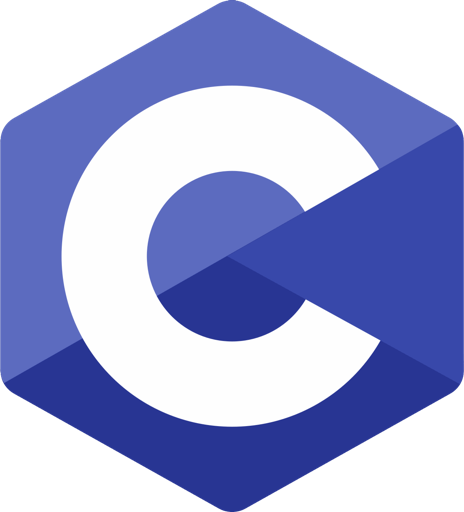
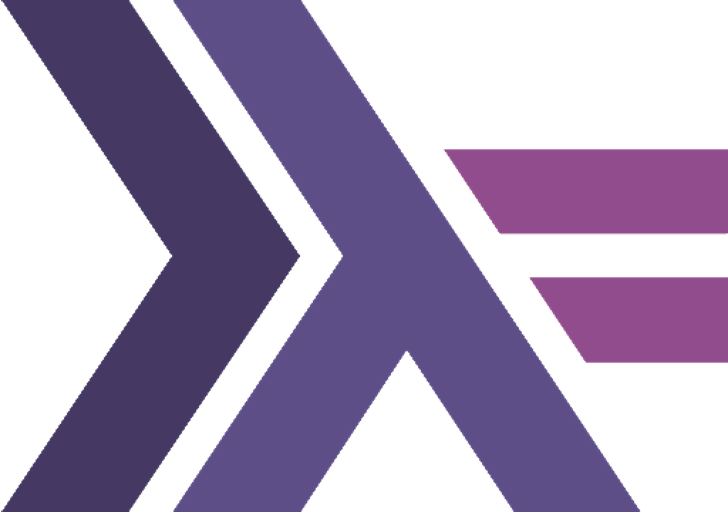
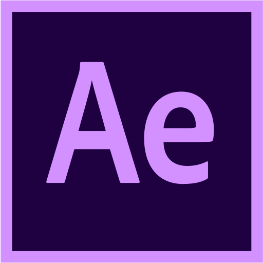

# Alexey "bru1t" Kuznetsov


<a href="https://vk.com/bru1t" target="_blank" title="VK Page">
  
</a> &nbsp;

<a href="https://www.facebook.com/lexey.ov" target="_blank" title="Facebook Page">
  
</a> &nbsp;

<a href="https://www.linkedin.com/in/bru1t" target="_blank" title="LinkedIn Page">
  
</a> &nbsp;

<a href="https://open.spotify.com/user/qlfeqhdjkznrcggijvyidxohq?si=42d180591660430a" target="_blank" title="Spotify Page">
  
</a>

---

```
GitHub
(c) Microsoft Corporation. All rights reserved.

C:\Users\bru1t>main_info.exe
>> PROGRAM START...

[X] INFO
-> Passionate backend developer from Moscow, Russia.
I try to do things that someone might need,
having fun with the code and f4ck with it,
to make it look pretty.

>> PROGRAM END
C:\Users\bru1t>
```

---

#### 🤔 About:
- 🎓 Bachelor's degree in Computer Science at MSU
- 👨‍👦‍👦 I love being involved in communities and help others do their job and grow
- 🤘 I like to do something memorable, even if it's my shit coding

---

#### 💻 Languages:

 &nbsp;
 &nbsp;
 &nbsp;
 &nbsp;
 &nbsp;
 &nbsp;
 &nbsp;


---

#### 🧰 Tools:

 &nbsp;
 &nbsp;
 &nbsp;
 &nbsp;
 &nbsp;
 &nbsp;
 &nbsp;


---

#### 📊 My Github Stats:


---

##### ☕ You can get me a coffee, if You like what I do
###### Rubles

Tinkoff: 5536 9138 6490 9359  
Raiffeisen: 5379 6530 4384 9510

###### Cryptocurrency

USDT (BEP20): 0x87b1b2ec62dfeaf58c27f136cab6bbd75f84892b  
XNO: nano_1tnga8itui6rf4imfroyboxzezt86ajwnjh9s6m11ybrfztj3fwhb4pbxc1i  
ETH (BEP20): 0x87b1b2ec62dfeaf58c27f136cab6bbd75f84892b  
